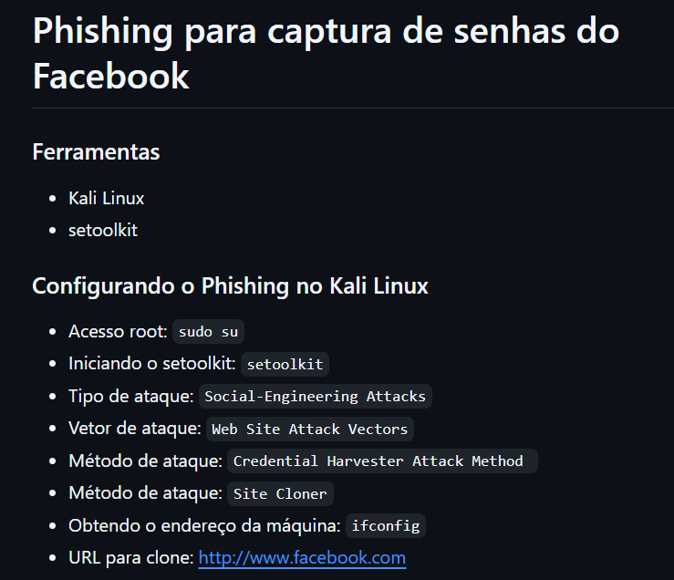
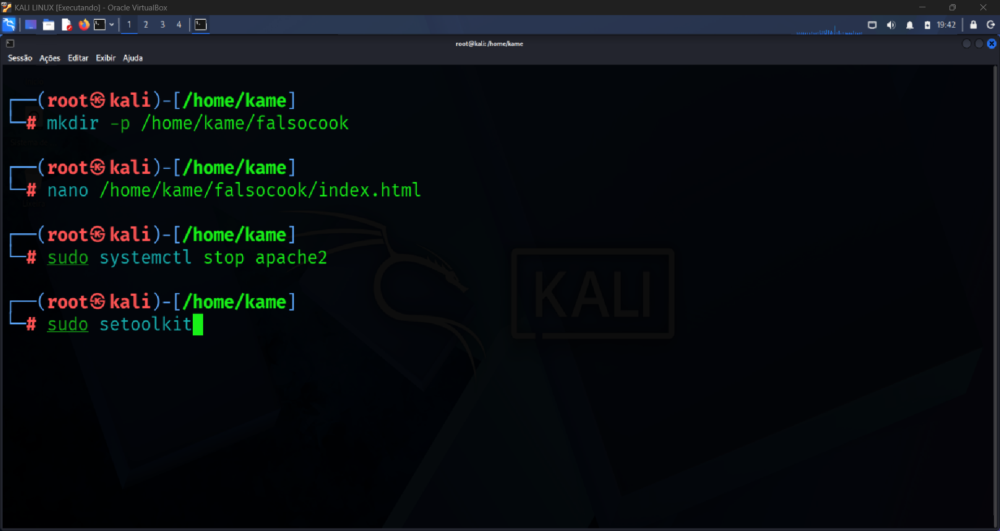
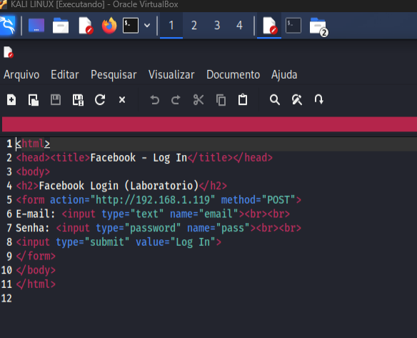
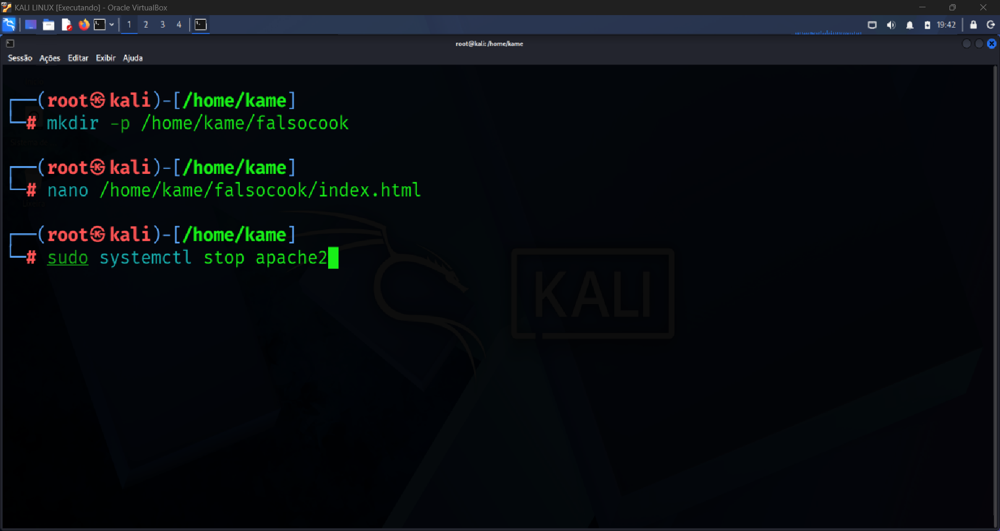
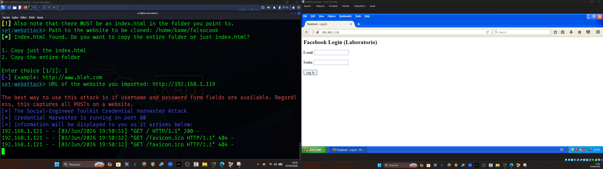
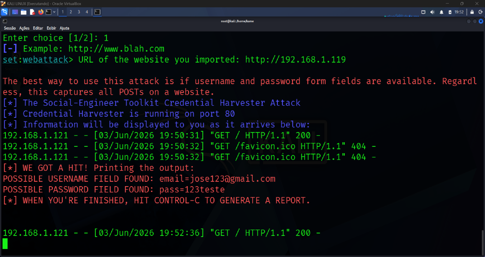

# CRIAÇÃO DE UM PHISHING COM O KALI LINUX

## Parte 1: O Desafio Inicial Proposto

O objetivo do laboratório foi utilizar o **SEToolkit (Social-Engineer Toolkit)** no Kali Linux para demonstrar a viabilidade de um ataque de engenharia social do tipo **Credential Harvester (Coleta de Credenciais)**.

O roteiro original previa o uso do método **Site Cloner** apontando para o site do Facebook (`http://www.facebook.com`).

A ideia era fazer com que uma máquina alvo (vítima) acessasse o servidor do atacante, visualizasse uma réplica da página de login, digitasse suas credenciais e permitisse a demonstração da captura de dados enviados por meio de formulários HTTP.

Todo o experimento foi realizado em ambiente isolado e controlado, utilizando máquinas variavelmente pertencentes ao próprio laboratório, sem interação com sistemas de terceiros.

Os passos que o professor passou para a resolução do problema são:


---

## Parte 2: O Problema Encontrado no Caminho

Ao tentar seguir o roteiro, o laboratório não obteve êxito devido às evoluções nos mecanismos de defesa e segurança adotados pela web moderna.

Grandes plataformas implementam diversas proteções que dificultam ou impedem a replicação automática de suas páginas por ferramentas mais antigas.

### Proteção HSTS (HTTP Strict Transport Security)

Navegadores modernos mantêm listas internas de domínios que obrigatoriamente devem utilizar conexões HTTPS.

Quando um usuário acessa domínios amplamente conhecidos, como `facebook.com`, o navegador automaticamente força a utilização de HTTPS, impedindo conexões inseguras via HTTP.

Como o ambiente de laboratório não possuía os certificados digitais legítimos do domínio original, a navegação encontrava restrições relacionadas à validação de segurança da conexão.

### Mecanismos Modernos de Proteção Contra Phishing

Além da criptografia obrigatória, aplicações modernas utilizam diversas camadas adicionais de proteção, incluindo:

- Tokens CSRF (Cross-Site Request Forgery);
- Políticas CORS (Cross-Origin Resource Sharing);
- Content Security Policy (CSP);
- Validações dinâmicas realizadas por scripts JavaScript;
- Cabeçalhos avançados de segurança.

Esses mecanismos dificultam a replicação funcional da página fora do ambiente oficial do serviço.

---

## Parte 3: Como Resolver o Problema

Considerando as limitações impostas pelas proteções modernas e pelo isolamento da rede do laboratório, optou-se por reproduzir os mesmos conceitos utilizando uma página local controlada.

O objetivo passou a ser demonstrar os fundamentos do protocolo HTTP e da coleta de dados enviados por formulários, sem depender de plataformas externas.

### Passo 1: Criação de um Vetor Local Customizado

Em vez de utilizar uma página obtida da internet, foi criado um formulário HTML simples diretamente no Kali Linux.

As seguintes etapas foram realizadas:

- Criação do diretório local:


```bash
/home/kame/falsocook
```


- Criação do arquivo `index.html` contendo:
  - Campo para usuário ou e-mail;
  - Campo para senha;
  - Botão de envio do formulário.



O formulário foi configurado para enviar os dados utilizando o método **POST** diretamente para o endereço IP privado do Kali Linux:

```text
[http://192.168.1.119](http://192.168.1.119)
```
A comunicação foi realizada utilizando HTTP puro, sem criptografia TLS/SSL.

### Passo 2: Inicialização do SEToolkit

Com o vetor local preparado, o SEToolkit foi configurado para atuar exclusivamente como servidor de captura.

As etapas executadas foram:

- Interrupção de serviços que poderiam utilizar a porta 80:

```bash
systemctl stop apache2
```

- Acesso ao menu Credential Harvester;
- Seleção da opção Custom Import;
- Importação da página HTML criada localmente.

Após a importação, o SEToolkit iniciou um servidor HTTP na porta 80, ficando disponível para receber conexões provenientes da máquina vítima.



### Passo 3: Acesso pela Máquina Vítima

A máquina vítima, executando Windows XP, foi utilizada para acessar diretamente o endereço IP do servidor configurado no Kali Linux.

Ao utilizar um endereço IP privado em vez de um domínio protegido, não houve aplicação das políticas HSTS normalmente associadas a domínios previamente cadastrados pelos navegadores.

Com isso, a página HTTP foi carregada normalmente dentro do ambiente de laboratório.

Quando o usuário preencheu os campos do formulário e clicou no botão de envio, os dados foram transmitidos em texto claro pela rede local.

O módulo Credential Harvester recebeu a requisição HTTP POST enviada pelo formulário e registrou os parâmetros informados pelo usuário, exibindo as credenciais capturadas no console do Kali Linux.



---

## Parte 4: Resultados Obtidos

O laboratório atingiu seu objetivo principal ao demonstrar:

- O funcionamento da comunicação cliente-servidor;
- O envio de dados por formulários HTML;
- A utilização de requisições HTTP POST;
- A captura de informações transmitidas sem criptografia;
- O funcionamento básico do módulo Credential Harvester do SEToolkit;
- A importância dos mecanismos modernos de proteção implementados pelos navegadores e aplicações web.



---

# Conclusão

Este laboratório demonstrou, de forma prática, como ocorre a transmissão de informações entre cliente e servidor em ambientes que utilizam HTTP sem criptografia.

Também foi possível observar que mecanismos modernos de segurança, como HTTPS, HSTS, CSP, CORS e validações dinâmicas de aplicações web, dificultam significativamente a execução de técnicas clássicas de engenharia social baseadas em clonagem de páginas.

Embora o cenário original não tenha sido reproduzido exatamente como previsto, a adaptação para um ambiente controlado permitiu compreender os conceitos fundamentais envolvidos na captura de credenciais, destacando a importância da criptografia, da validação de identidade dos servidores e da conscientização dos usuários quanto aos riscos associados à engenharia social.

Os resultados obtidos reforçam a relevância das boas práticas de segurança da informação e demonstram como mecanismos modernos de proteção contribuem para reduzir a exposição de credenciais e dados sensíveis em ambientes computacionais.